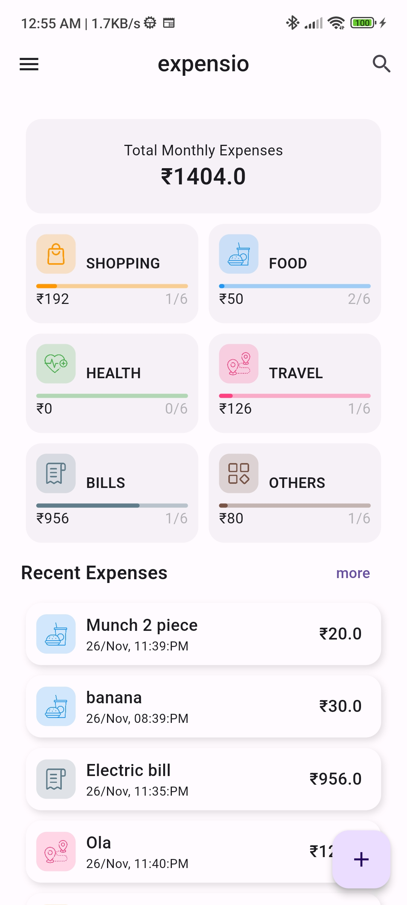
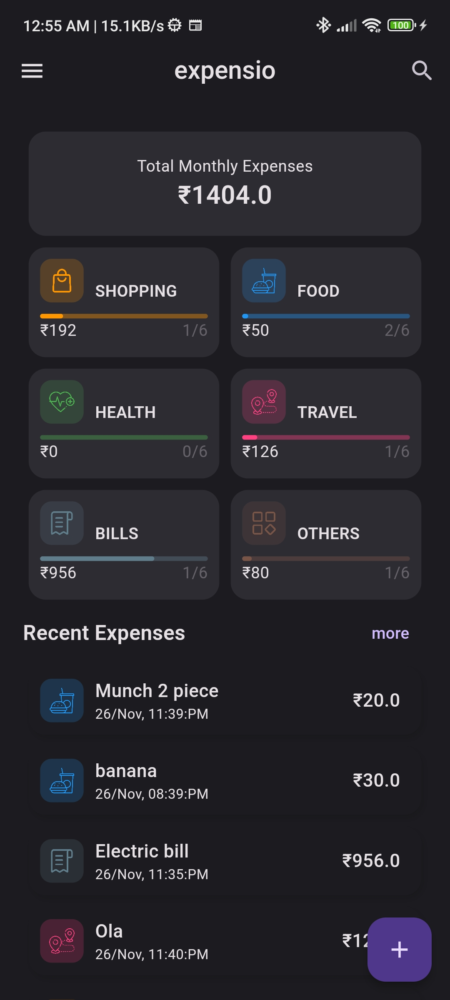
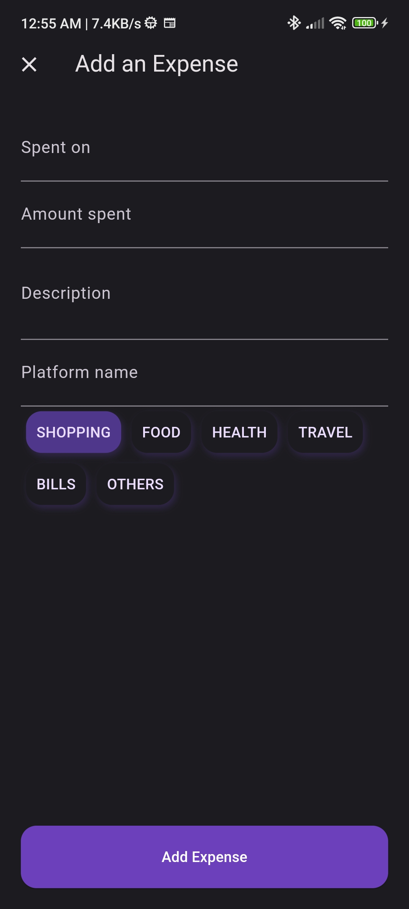
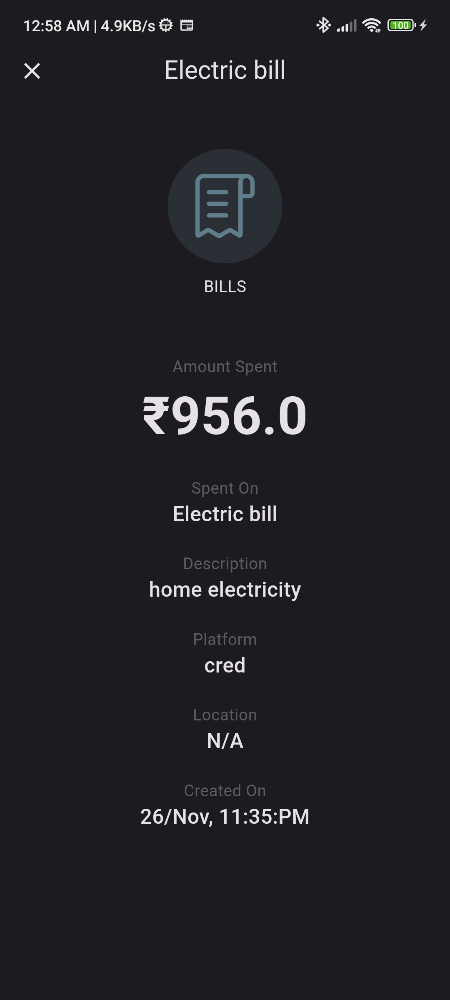
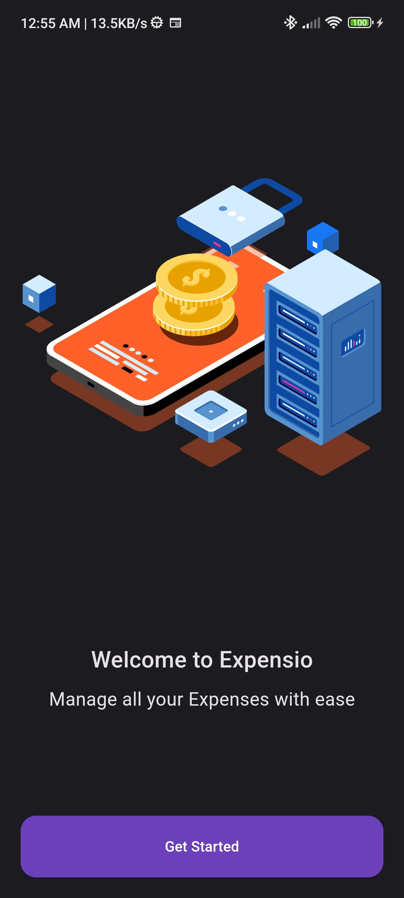
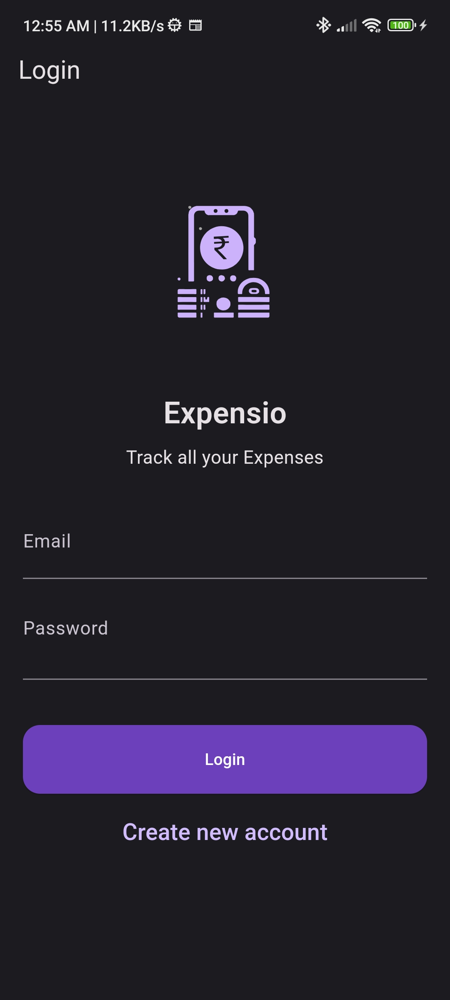
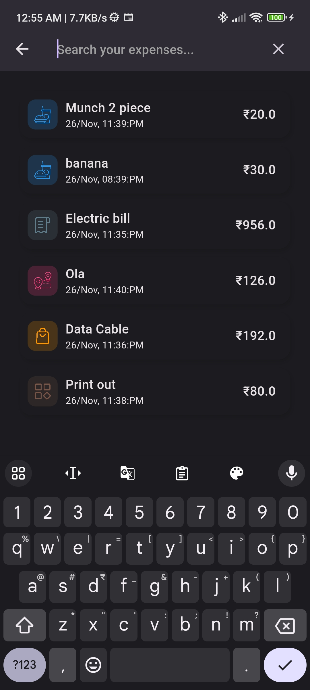
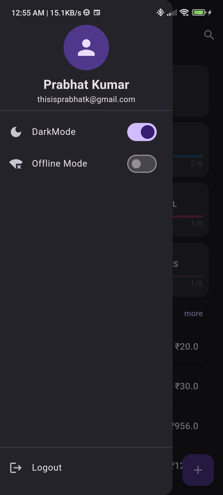

# expensio

An Expense Tracker app, Expensio built using flutter with firebase and hive db.
- User can login to the app
- User can switch between local db and firebase cloud db
- User can switch between darkMode and lightMode

## Download apk
https://drive.google.com/file/d/1AvNXObJ4IBxnIrq4MwQNet7pdm97_hfy/view?usp=sharing

## ScreenShots










## Project Structure

```
lib
├───core
│   ├───constants
│   ├───config
│   └───utils
├───data
│   ├───models
│   └───repositories
│       ├───local
│       │   ├───config_repo
│       │   └───expenses_repo
│       ├───remote
│       │   ├───auth_repository
│       │   ├───user_repository
│       │   └───expenses_repo
│       └───common_interfaces
├───domain
│   ├───bloc
│   │   ├───auth_bloc
│   │   ├───config_bloc
│   │   └───expenses_bloc
│   └───exceptions
└───presentation
    ├───screens
    │   ├───authentication
    │   │   └───components
    │   ├───search
    │   ├───splash
    │   ├───homescreen
    │   │   └───components
    │   ├───onboarding
    │   ├───add_expense
    │   │   └───components
    │   └───view_expenses
    └───widgets

```

## Pending Features
- View monthly data
- Add upload monthly image